# A. 课程体系的介绍

1. HTML + CSS 与 HTML5 + CSS3

        学习完 HTML+CSS 之后，常规的网页，我们都可以写出来。
        学习完 HTML5 + CSS3 ，我们可以用简单的方式，写出一些更加绚丽的页面。
        包括PC端布局，移动端布局，响应式布局。

2. 客户端脚本语言 JavaScript

        包含 Bootstrap, jQuery, less, sass 等。
        这个是前端工程师最重要的课程。
        炫酷的特效，逻辑思维的锻炼。

3. NodeJS + Express + MongoDB + Vue.js

        包括实时通讯

4. 高级 JavaScript

        HTML5新增特性
        如地理定位，拖拽上传，Canvas等

5. 微信开发

6. 企业级HTML移动应用开发 Web APP

# B. 谈谈程序员

    1. 程序员是彻头彻尾的脑力工作者(Mind Worker)，怠于思考者绝对不能成为好的程序员。
	2. 程序员，往往是懂得变通，懂得交流，会说会笑，思维灵活的人。
	3. 程序员都有着严密的思维逻辑
	4. 程序员是创造者。
	5. 程序员不只是单纯地敲代码。他是可以帮助别人，帮助自己解决问题的人。
	6. 程序员懂得如何与机器交流，赋予机器灵魂的人。
	7. 程序员让全世界的人都享受到了非常多的便捷，节省了非常多的人力，物力。
    8. 学习程序的三要素: 想得明白，算得准确，写得清楚

# C. Internet是什么呢？

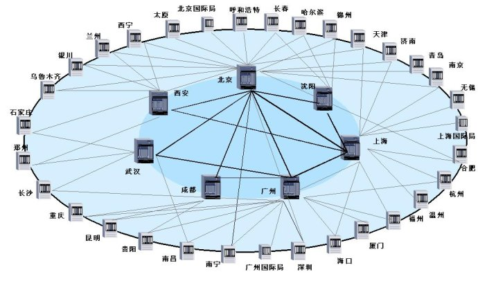

互联网或国际网（英语：Internet），是网络与网络之间所串连成的庞大网络，这些网络以一组标准的网络TCP/IP协议族相连，连接全世界几十亿个设备，形成逻辑上的单一巨大国际网络。它是由从地方到全球范围内几百万个私人的、学术界的、企业的和政府的网络所构成，通过电子，无线和光纤网络技术等等一系列广泛的技术联系在一起。这种将计算机网络互相联接在一起的方法可称作“网络互联”，在这基础上发展出覆盖全世界的全球性互联网络称互联网，即是互相连接一起的网络。

#### TCP/IP
传输控制协议/因特网互联协议/网络通讯协议，英文: Transmission Control Protocol/Internet Protocol.

##### TCP:
定义了电子设备如何连入因特网，以及数据如何在它们之间传输的标准，如:负责创建连接，数据传送，终止连接，校验(如丢包)等，保证可靠传输，一种传输控制协议。

##### IP:
在Internet上连接的所有计算机，从大型机到微型计算机都是以独立的身份出现，我们称它为主机。为了实现各主机间的通信，每台主机都必须有一个唯一的网络地址。就好像每一个住宅都有唯一的门牌一样，才不至于在传输资料时出现混乱。Internet的网络地址是指连入Internet网络的计算机的地址编号。所以，在Internet网络中，网络地址唯一地标识一台计算机。
我们都已经知道，Internet是由几千万台计算机互相连接而成的。而我们要确认网络上的每一台计算机，靠的就是能唯一标识该计算机的网络地址，这个地址就叫做IP（Internet Protocol的简写）地址，即用Internet协议语言表示的地址。

在Internet里，IP地址是一个32位的二进制地址，为了便于记忆，将它们分为4组，每组8位，由小数点分开，用四个字节来表示，而且，用点分开的每个字节的数值范围是0~255，如202.116.0.1，这种书写方法叫做点数表示法。

# D. 软件体系结构

>   网络系统软件开发包括B/S与C/S两种结构都可以进行同样的业务处理。

	1. C/S是客户机(client)/服务器（server）
		1. 要求拥有特定客户端
		2. QQ就是C/S模式，你的桌面上的QQ就是腾讯公司的特定的客户端，而服务器就是腾讯的服务器。
		3. PPTV,PPS,LOL,各种游戏客户端，都是C/S结构

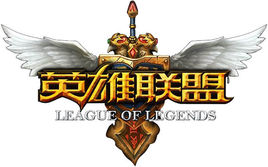

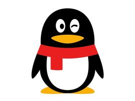

	2. B/S是浏览器（browser)/服务器。
		1. B/S模式是靠应用层的http协议进行通信的（当然也要靠底层的好多协议支持）
		2. 一般不需要特定的客户端，而是需要有统一规范的客户端，那就是你的浏览器！
		3. Web页就是B/S模式，也就是说咱们说的网站就是B/S模式。

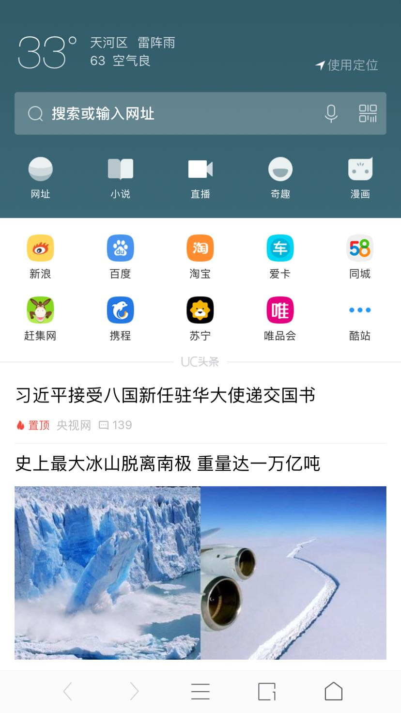

# E. web介绍

万维网（英语：World Wide Web），亦作“WWW”、“Web”，是一个由许多互相链接的超文本组成的系统，通过互联网访问。它是一种基于超文本和HTTP的、全球性的、动态交互的、跨平台的分布式图形信息系统。它是建立在Internet上的一种网络服务，为浏览者在Internet上查找和浏览信息提供了图形化的、易于访问的直观界面，其中的文档及超级链接将Internet上的信息节点组织成一个互为关联的网状结构。

关键人物: 蒂姆·伯纳斯·李 "万维网之父"，英国计算机科学家，他是万维网的发明者，南安普顿大学与麻省理工学院教授。

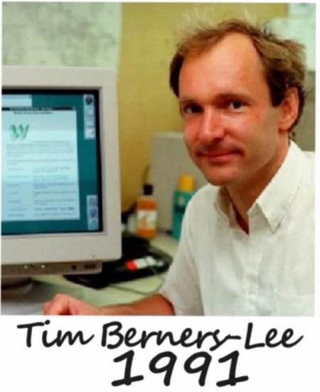

#### 大学时期

纳斯进入大学，1976年从牛津大学物理系获得一级荣誉学位，毕业之后，曾经供职于英国一些高技术公司，从事集成电路和系统设计研究，其出众的才华逐渐得以展露。1984年，一个偶然的机会，伯纳斯来到瑞士的日内瓦，进入著名的由欧洲原子核研究会（CERN）建立的粒子实验室。该实验室的首席研究员是华裔物理学家、诺贝尔奖获得者——丁肇中。

在这里年轻的蒂姆接受了一项极富挑战性的工作：为了使欧洲各国的核物理学家能通过计算机网络及时沟通传递信息进行合作研究，委托他开发一个软件，以便使分布在各国各地物理实验室、研究所的最新信息、数据、图像资料可供大家共享。软件开发虽非蒂姆的本行，但强有力的诱惑促使他勇敢地接受了这个任务。

早在牛津大学主修物理时蒂姆就不断地思索，是否可以找到一个"点"，就好比人脑，能够透过神经传递、自主作出反应。经过艰苦的努力，他编制成功了第一个高效局部存取浏览器"Enquire"，并把它应用于数据共享浏览等，取得了成功。

>
    1. web（World Wide Web），中文"万维网"，一般简写为WWW。
    2. www 可以让Web客户端（常用浏览器）访问Web服务器上的页面。
    3. www 是一个由许多互相链接的超文本组成的系统，通过互联网访问。
    4. 在这个系统中，每个有用的事物，称为“资源”；并且由一个“统一资源定位符”（URL）标识；这些资源通过超文本传输协议（Hypertext Transfer Protocol，简称HTTP）传送给用户，而后者通过点击链接来获得资源。
    5. 通过万维网，人们只要通过使用简单的方法，就可以很迅速方便地取得丰富的信息资料。由于用户在通过 Web浏览器访问信息资源的过程中，无需再关心一些技术性的细节，而且界面非常友好，因而 Web 在Internet 上一推出就受到了热烈的欢迎，走红全球，并迅速得到了爆炸性的发展。

# F. web 开发所需的构件

##### 1. 客户端浏览器(Browser)

   1. 浏览器是指可以显示网页服务器或者文件系统的HTML文件内容，并让用户与这些文件交互的一种软件。
   2. 网页浏览器主要通过HTTP协议与网页服务器交互并获取网页，这些网页由URL指定，文件格式通常为HTML。
   3. 通向世界的窗口，一款发送和接收，呈现HTML超文本的客户端软件。
   4. 负责解析翻译HTML代码，相当于我们与机器之间的翻译官
   5. 浏览器主要通过HTTP协议与服务器交互并获取网页内容
   6. HTTP协议与URL协议允许网页设计者在网页中嵌入图像、动画、视频、声音、流媒体等。
   7. 主流五大网页浏览器
        微软的Internet Explorer（IE）
        Mozilla的Firefox（火狐）
        Apple的Safari
        Opera（欧朋）
        Google Chrome（谷歌）

    其它：360安全浏览器、世界之窗、搜狗浏览器、傲游浏览器、腾讯TT等

	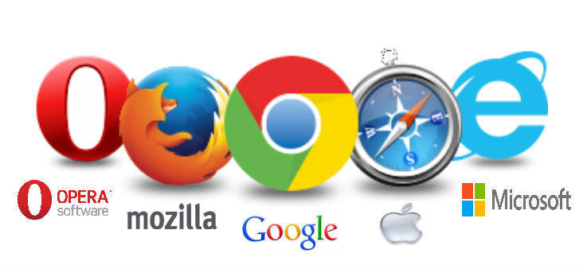

##### 2. HTML

   超文本标记语言（英文：HyperText Markup Language，HTML）！
   “超文本”就是指页面内可以包含图片、链接、音频、视频、程序等非文字元素。

##### 3. CSS
   层叠样式表(英文全称：Cascading Style Sheets)。
   用于控制Web页面的外观

##### 4. JavaScript
一门客户端脚本编程语言!
用来给HTML网页增加动态功能，制作特效，提高人机交互，用户体验。

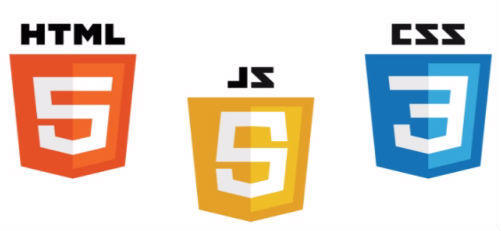

##### 5. 服务器端脚本编程语言
服务器端脚本语言有很多，常用的有Microsoft的ASP、SUN的JSP和ZEND的PHP

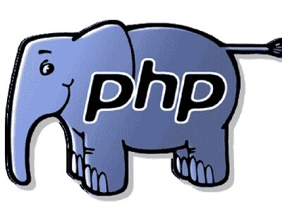

##### 6. 数据库管理系统

1. 数据库是什么？

    电子化的文件柜，用于存储电子文件
    用户可以对电子文件进行新增、截取、更新、删除等操作

2. 数据库有那些？

    	MySQL
    	Oracle
    	IBM-DB2
    	SQL Server
    	...

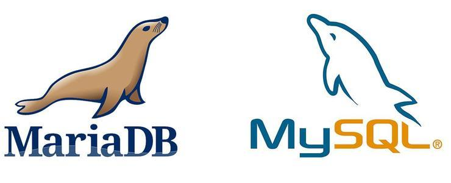

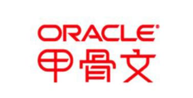

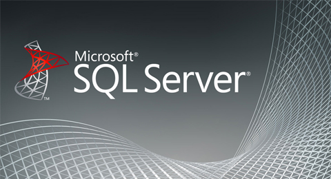

##### 7. web服务器

1. WEB服务器也称为WWW(WORLD WIDE WEB)服务器，主要功能是提供网上信息浏览服务。
2. Web服务器一般指网站服务器，可以向浏览器等Web客户端提供文档，让全世界浏览；可以放置数据文件，让全世界下载。
3. 从两个维度去了解服务器

        硬件:
             就是一台性能强悍的计算机(电脑)。由于需要提供高可靠的服务，
             因此在处理能力、稳定性、可靠性、安全性、可扩展性、可管理性等方面要求较高。

        软件：
             目前最主流的三个Web服务器是Apache、IIS、Nginx

长期以来，人们只是通过传统的媒体（如电视、报纸、杂志和广播等）获得信息。但随着计算机网络的发展，人们想要获取信息，已不再满足于传统媒体那种单方面传输和获取的方式，而希望有一种主观的选择性。并且由于计算机网络的发展，信息的获取变得非常及时、迅速和便捷。web得到了迅猛的发展。

#### 云服务

#### 服务器机房

# G. 万维网三项关键技术
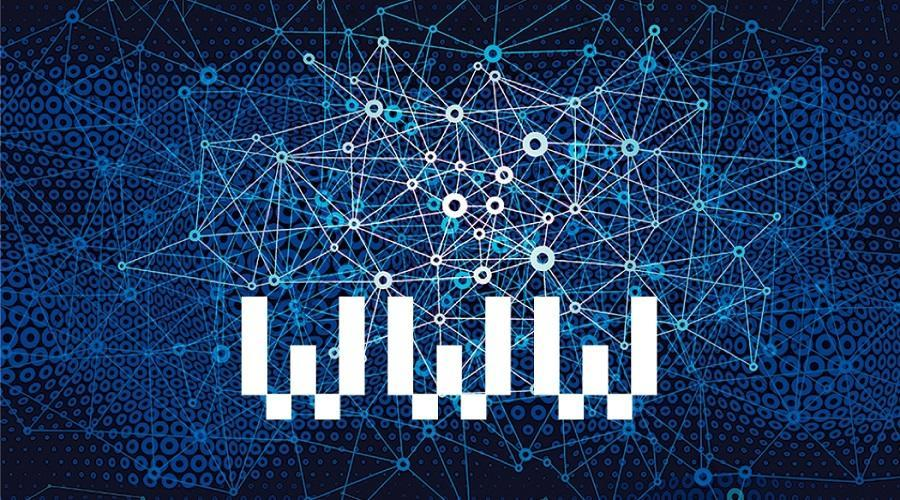

* 超文本标记语言(HTML)
* 统一资源定位符(URL)
* 超文本传输协议(HTTP)

##### 1. URL

网络世界就像浩瀚的宇宙，在宇宙中如何找到一个网站，浏览内容？ --- 通过网站地址
与现实生活一致，双方要寄信，都必须要知道对方的地址！

1. 认识URL

		1. Uniform Resource Locator，统一资源定位符
		2. URL == 网址
		3. 每个网页也都有一个Internet地址，就像每家每户都有一个门牌地址一样，服务器上供用户浏览的页面，都是以文件形式存放的，为了便于查找。
		4. 每页都有惟一的一个地址，这个地址就叫URL

2. URL的组成

        协议://主机:端口/路径/文件名?参数1=值1&参数2=值2#锚点
        http://www.baidu.com/dir/index.php?wd=http

##### 2. HTTP 协议

1. 协议:

        双方共同遵守的一些规则。
        协议无处不在，机器没有思维，只会遵守约定的协议进行工作。

2. HTTP协议:

        1. 英文全称(HyperText Transfer Protocol，超文本传输协议)。
        2. HTTP协议是用于从WWW服务器传输超文本到本地浏览器的传输协议。
        3. HTTP协议是互联网上应用最为广泛的一种网络传输协议。
        4. 设计HTTP最初的目的是为了提供一种发布和接收HTML页面的方法
        5. 服务器与浏览器要进行信息交流，使用的就是HTTP协议

* HTML、URL和HTTP三个规范构成了Web的核心体系结构，是支撑着Web(万维网)运行的基石。
* 客户端(浏览器)通过URL找到网站(如：www.google.com)，发出HTTP请求，服务器收到请求后返回HTML页面。

* Web运行原理

    	客户端主动请求，服务器被动响应
        一次请求，一次响应

# H. 学习分享

1. 拒绝二指禅

        左手: ASDF 右手: JKL;

2. 文件

        先新建，保存！
        必须显示文件后缀

3. 标签怎么写

        * 标签成对出现，再填充内容
            <html>
                内容
            </html>

4. 代码风格

        1. 缩进与换行
            使用 4 个空格做为一个缩进层级(父子层级)，不允许使用 2 个空格 或 tab 字符。

        2. 每行长度
            每行建议不要超过 120 个字符。
                过长的代码不容易阅读与维护。

        3. 请使用小写

        * 编码规范还有很多

5. 边读，边写

<!--  -->
