# HTML是什么？

1. HTML是 Hypertext Markup Language 的英文缩写,即超文本标记语言。
2. HTML是用来制作网页的标记语言。
3. HTML语言是一种标记语言,不需要编译,直接由浏览器解析执行。
4. HTML文件是一个文本文件,包含了一些HTML元素,标签等。
5. HTML文件必须使用.html或.htm为文件名后缀。(像DOS这样的旧操作系统限制扩展名为最多3个字符，所以.htm扩展名也被使用)
6. HTML是通向 WEB 技术世界的钥匙。
7. HTML是由W3C的维护的。

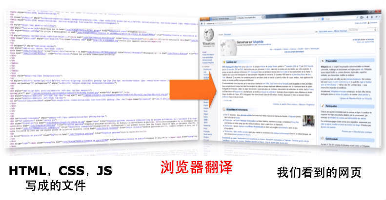

* 普通的文本:
    只能显示单纯的文字，过于单调，没有任何色彩，无法勾起人们的阅读的"欲望"！

* 超文本:
    不仅可以加入文字，还可以加入链接、图片、声音、动画、视频等内容的文本文件。

* 标记语言:
    HTML严格来说不属于编程语言，它没有任何的逻辑判断，以及运算，HTML是通过标签标记来描述文档的结构和语义。

    HTML中的每个用来作为标签的符号都是一条命令，它告诉浏览器如何显示文本。如：斜体、加粗、换行等。


* 当我们阅读一篇文章的时候，看到如：《金瓶梅》、《JAVA从入门到跳楼》我们就知道，使用书名号括起来的是书名。


# HTML的发展历程(了解)

0. 由蒂姆·伯纳斯-李Tim Berners-Lee给出原始定义
1. HTML 1.0 —— 在1993年6月作为互联网工程工作小组（IETF）工作草案发布（并非标准）。
2. HTML 2.0 —— 1995年11月作为RFC 1866发布，在RFC 2854于2000年6月发布之后被宣布已经过时(在HTML 4.01 发布后，宣布过时)
3. HTML 3.2 —— 1997年1月14日，W3C推荐标准
4. HTML 4.0 —— 1997年12月18日，W3C推荐标准
5. HTML 4.01（微小改进）——1999年12月24日，W3C推荐标准

#### 插曲(了解)

1. 当时的HTML，它异常灵活，容错性非常强，HTML语法规则定义较为松散，这样对网页编写者来说，比较方便，但对于机器来说，语言的语法越松散，处理起来就越困难。对于传统的计算机来说，还有能力兼容松散语法，但对于许多其他设备，比如手机，难度就比较大。

2. 面对这些情况，2000年底，国际W3C组织（万维网联盟）组织公布发行了XHTML 1.0版本。W3C研发XHTML目的就是想让HTML的语法更加严谨，制定好语言的规范，并且取代 HTML 4.01。

3. XHTML(中文为 "可扩展超文本标记语言"，英文为 "Extensible HyperText Markup Language")，表现方式与超文本标记语言（HTML）类似，不过语法上更加严格。XHTML与HTML看起来很像，只有一些小的但重要的区别。XHTML 1.0是一种在HTML 4.0基础上优化和改进的的新语言。

4. XHTML，足够灵活，更加严谨，更加纯正，能力强大，但是当时，但面对成千上万已有的基于HTML语言设计的网站，所有网站遵守的都是语法松散的HTML（甚至到目前为止，市面上绝大部分的网站语法都是不规范的），如果贸然改变遵守的标准，则会导致浏览器无法解析执行原有的网站，则意味着所有的网站需要重写或者大量修改。
由于贸然修改，带来的影响巨大，并且为时过早，各大厂商并不卖账，于是由各大厂商联合起来，成立 WHATWG 组织机构，从新基于HTML4.01，兼容老旧语法，推动一项新标准 "HTML5"。

5. HTML 5 —— 2014年10月，W3C推荐标准
HTML 5 的第一份正式草案已于2008年1月22日公布。于2014年10月29日，万维网联盟宣布，经过接近8年的艰苦努力，该标准规范终于制定完成。


### 几个非盈利机构(了解)

##### WHATWG

网页超文本应用技术工作小组（英语：Web Hypertext Application Technology Working Group，缩写：WHATWG），是一个以推动网络HTML标准为目的而成立的组织。在2004年，由Apple公司、Mozilla基金会和Opera软件公司所组成。

##### IETF

国际互联网工程任务组（The Internet Engineering Task Force，简称 IETF）。互联网工程任务组，成立于1985年底，是全球互联网最具权威的技术标准化组织，主要任务是负责互联网相关技术规范的研发和制定，当前绝大多数国际互联网技术标准出自IETF。

IETF是一个由为互联网技术工程及发展做出贡献的专家自发参与和管理的国际民间机构。它汇集了与互联网架构演化和互联网稳定运作等业务相关的网络设计者、运营者和研究人员，并向所有对该行业感兴趣的人士开放。任何人都可以注册参加IETF的会议。

IETF的主要任务是负责互联网相关技术标准的研发和制定，是国际互联网业界具有一定权威的网络相关技术研究团体。

#### W3C

Web标准化机构，又称"W3C理事会"或"万维网联盟"！

1994年，Tim Berners Lee创立了著名的W3C（World Wide Web Consortium，万维网联盟）组织，因为 蒂姆·伯纳斯·李 觉得Web发展迅猛，需要有一个类似基金会或委员会的机构来规范，以达成全球统一标准。

W3C组织是对网络标准制定的一个非赢利组织，像HTML、XHTML、CSS、XML的标准就是由W3C来定制。近几年的HTML5也是他们规定的。
W3C后来制定了一系列的语言和规范：HTML，CSS，XML等。
W3C会员(约500名)包括生产技术产品及服务的厂商、内容供应商、团体用户、研究实验室、标准制定机构和政府部门，一起协同工作，致力在万维网发展方向上达成共识。

W3C最重要的工作是发展 Web 规范（称为“推荐”，Recommendations），这些规范描述了 Web 的通信协议（比如 HTML 和 XHTML）和其他的构建模块。


# HTML5

#### 1. HTML5 介绍

1. HTML5是HTML最新的修订版本。
2. HTML5实际指的是包括HTML、CSS、JavaScript、API在内的一套技术组合。
3. HTML5的目标是取代1999年所制定的HTML 4.01和XHTML 1.0标准。
4. HTML5废除一部分属性与标签元素。
5. HTML5重新定义或者标准化一部分属性与标签。
6. HTML5希望减少网页浏览器对于插件的依赖。
7. HTML5添加了许多新的语法特征，其中包括<video>、<audio>和<canvas>元素。


#### 2. HTML5的优势

1. 向后兼容能力：HTML5内封装了之前所有版本的文档类型。
2. 更简单的语法：语义更为完善，编码更为高效，文档也更为小型化。
3. 新元素及其属性使得我们的设计与开发工作变得更为灵活。
4. 拥有视频与音频插件，支持媒体定时播放功能。
5. 拥有20多个新型脚本API（Application Programming Interfaces，应用程序接口）插件，其中包括：

	    Canvas元素的2D图形功能；
	    文档编辑功能；
	    拖放功能；
	    地理定位功能；
	    本地离线存储；
	    媒体捕获功能；
	    本地SQL数据库;
	    网络消息;
	    网络存储;
	    文件处理;
	    ...

6. HTML5将会使开发变得更容易，用户体验更强大。


#### 3. HTML5的劣势

* 浏览器支持不统一

一直以来HTML5都以跨平台著称，但实际上要实现这一目标工作量巨大，HTML5缺少一个浏览器的标杆（Webkit有希望成为），尤其目前在IE6/7/8占有率居高不下的情况下，存在麻烦的兼容性问题，希望用HTML5跨全平台基本是不可能的。


#### 4. 学会HTML5，我们可以做什么？

1. 网站页面

    1. PC页面

    	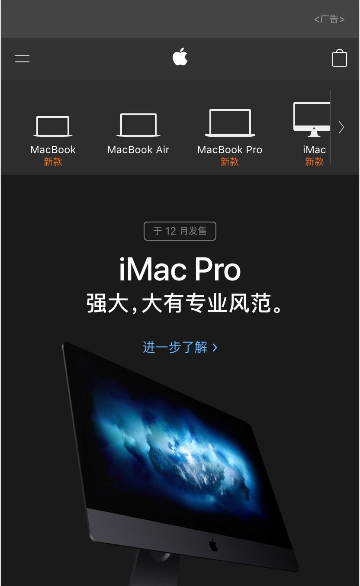

    2. 响应式页面: 根据页面的尺寸大小，进行调整显示不同的外观，从而适应当前设备。

    	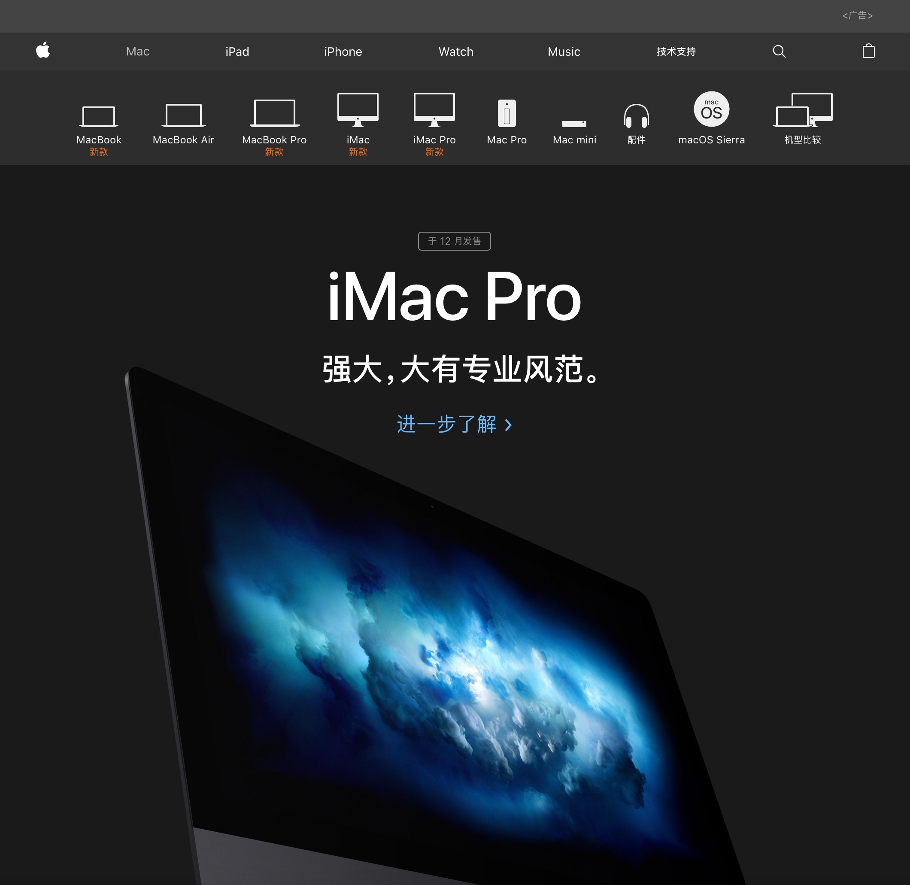

2. webApp

    WebApp是指基于Web的系统和应用程序，运行于网络和标准浏览器之上，基于网页技术开发实现特定功能的应用。
    HTML5 web app 具有开发快速，极强的跨平台性能等特点，可以实现一次开发，多个手机平台同时适用。

    如: 百度，淘宝，京东，携程，webQQ

    App内置应用: 微信钱包，支付宝

	
	

	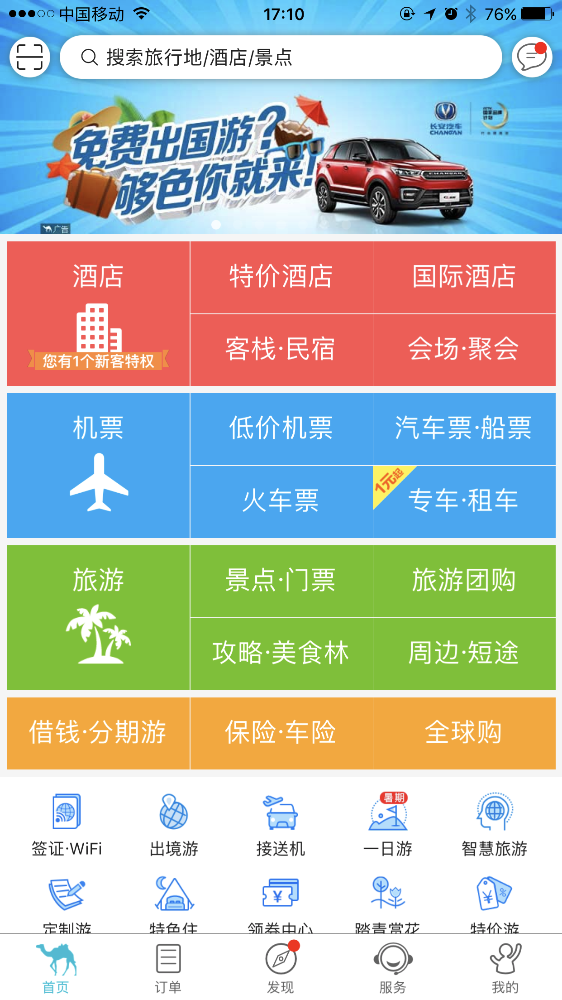
	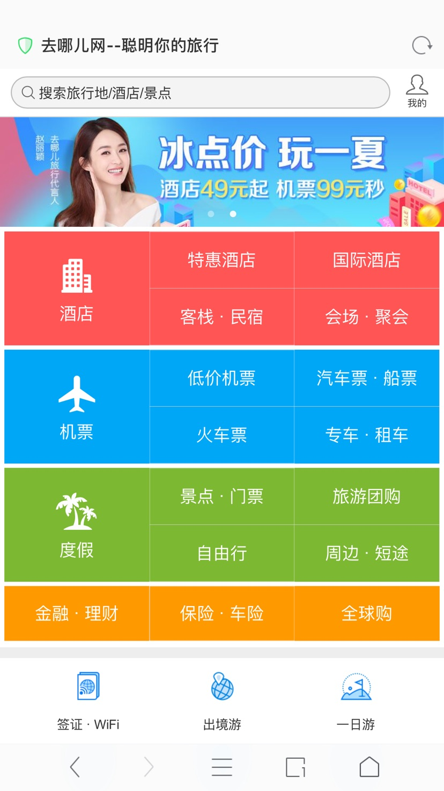

3. 手机App
    通过 HTML5 + CSS3 + JavaScript 可以开发 IOS，Android，WindowsPhone 等不同操作系统的应用程序。通过特定的软件，对HTML5的源码进行打包封装，成为指定系统的应用程序(Application,简称:APP)。

    但是受到网速，以及智能设备性能瓶颈等原因的限制，HTML5 Web应用还处于萌芽发展阶段，不过，这是未来的趋势。

    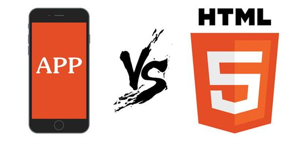

4. 游戏
    基于HTML5的手游以及页游。

    
    
    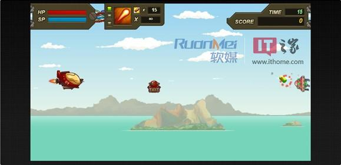

5. 三维图形和动画
    在web 2.0时代，我们只能通过对元素的特殊叠加来产生3D的视觉效果，但是HTML5的3D引擎却可以更方便的实现3D效果，而且更加逼真。

6. 如今比较火爆的微信小程序在开发的过程中就用到了HTML5技术。

	

7. 实现多媒体更加简单
    我们可以利用HTML5的<video>和<audio>非常方便的在网页上添加视频和音频，不需要很复杂的代码，你就能打造一款功能齐全的HTML5播放器。

9. 一次编写，随处部署——HTMl5可以在浏览器中、在平板电脑和桌面上运行，你可以把它转化为原生代码来支持iOS和Android。这是其他方式都无法做到的。

10. 手机如今可以说成为我们生活中的一部分，而移动互联网的出现更是让我们离不开手机。而移动互联网之所以能如此吸引我们，那就是因为HTML5给我们带来了很多丰富的功能、体验。

11. 互联网的各种应用，都离不开了HTML5的技术。


# HTML的兼容性介绍(了解)


#### 网页浏览器之争(兼容性诱因)

##### 背景

万维网是基于互联网的超文本系统，由蒂姆·伯纳斯-李（web之父）于20世纪80年代末和90年代初所发明。伯纳斯-李编写了第一个图形化网页浏览器 World Wide Web，后来更名为Nexus，并于1991年发布到NEXTSTEP平台。

1993年代初期出现了许多浏览器，其中最具影响力的是 Mosaic ，这款浏览器将 Web 带向了群众。这是由美国国家超级电脑应用中心（NCSA）所开发的多平台浏览器，并且授权予多间公司，让它们创造自己的产品。


##### 早期竞争

Mosaic的开发者之一马克·安德森，于1994年成立了名为 Mosaic Communications Corporation 的公司，并开发了Mosaic Netscape浏览器。为了解决与NCSA间的法律问题，该公司改名为网景通信公司（Netscape Communications Corporation），浏览器也改名为网景导航者（Netscape Navigator）。Netscape改进了Mosaic的实用性及稳定性，同时在网络上提供免费试用版，很快便统领浏览器的市场。

1. 1995年中期，人们开始注意万维网，而当时的市场及网页浏览标准均以Netscape主导。与此同时，微软在获取Mosaic的授权后，推出了Internet Explorer 1，于8月起通过“Windows 95 Plus!”搭售。

2. 三个月后，Internet Explorer 2推出，而激烈竞争就此开始。在往后几年，网景和微软随后也陆续各自推出新版本的 Internet Explorer 和 Netscape Navigator。 因为当时浏览器必须具备更多新功能，否则会被认为是落后的，因此当时着重产品功能特色多于修正错误，导致产品也多是不稳定的、造成网页标准分歧、时常死机和安全漏洞等问题，为用户带来困扰。
1996年，微软推出Internet Explorer 3版，成为第一款支持编程语言及CSS的商用浏览器，使市场占有率开始紧追Netscape。

3. 1997年10月，Internet Explorer 4版正式推出，并在旧金山举行产品发表会，而引人注目的地方便是竖立了一个10呎长的巨型"e"标志。第二天早晨，Netscape的工作人员在前面的草坪上发现了巨型标志，上面写着“From the IE team ... We Love You”。Netscape的员工立刻把巨型标志推翻，并放上其吉祥物Mozilla恐龙，恐龙手上纸牌写着“Netscape 72, Microsoft 18”，代表当时的浏览器市场占有率。

4. 但随着Internet Explorer 4的推出，对这场浏览器大战产生了重大改变，它在匹配W3C制定的网页标准方面，做得比Netscape Navigator 4.0要好，同时也能加载动态网页，其文字或图像的位置可以改变。此外，安装了IE4.0被认为是系统的升级，能增加不少功能，包括可以播放MP3音乐。

5. 在IE和Netscape大战期间，网页设计者通常会把“用Netscape可获得最好效果”或“用IE可获得最好效果”的标志放在首页，并连到下载相关产品的网址上。这样的网页会让开放标准造成分歧，忽略双方各浏览器的用户，因此有人发起了“可用任何浏览器浏览”（Viewable With Any Browser）运动，要求令网页无论使用IE或Netscape均能正常浏览。

##### IE的统领

微软在浏览器大战拥有两大优势：

第一是财力雄厚，Netscape浏览器虽曾一度达90%以上占有率，但公司的规模相对较小，总收入也不及微软，产品方面也仅有浏览器及相关产品。

微软的另一个优势，在于其Windows垄断了操作系统市场。纵使早期Internet Explorer的评价比Netscape差，微软把Internet Explorer与Windows捆绑销售，仍可以增加其占用率。另外，微软把Internet Explorer变成免费，开发资金从Windows的庞大收益中拨出，当产品功能开发至与Netscape同等程度时，用户便不再下载Netscape使用，而改用Internet Explorer。

除此之外，微软也曾使用以下手段打击Netscape：

1. Netscape的商业模式是通过销售服务器软件来发布浏览器，微软得知这点，便把自家的IIS服务器通过Windows服务器版本搭售，内含仿制Netscape产品的代理、电邮、新闻组服务器、以及其他软件，并以特优价格发售，以切断Netscape的财源。起初效果不大，由于Netscape的收入多来自使用Sun服务器的客户，因此微软需要使Windows NT更普及，作为内部网及互联网的服务器。
2. 微软在授权条款中，要求主机厂商在桌面上展示IE的图标，并不得加入Netscape，否则将以涨价方式作出惩罚。
3. 微软让中小型ISP推出附有ISP品牌的IE，使不少ISP鼓励用户改用IE，放弃Netscape。
4. 微软在与AOL的授权条款中，要求AOL以IE作为主接口，而非Netscape。
微软在收购得来的FrontPage网页设计软件中，加入了非标准的专属标签，令作出的网页只适合使用IE浏览器。
5. 微软率先在IE支持CSS，网页设计者认为制作支持IE的网页比支持Netscape的容易。
6. 以上手段的目的是要断绝Netscape的财路，加上Netscape自身错误的商业决策，使得Netscape于1998年年底，被IE击败。其后美国在线（AOL）以42亿美元收购网景业务(后来诞生了火狐)。IE开始统领浏览器市场，份额的最高峰达到2002年的96%，比Netscape的高峰还要高。
在IE击溃主要对手后，第一轮大战结束，而浏览器的创新也随之减少。

##### 带来的后果

在大战中，两者在浏览器开发上，为压倒对手，做出了以下两大行为：
	1. 着重加入新功能，忽略了修正错误。
	2. 使用专属格式，不尊重公开标准。


1. 当单一公司寡占浏览器市场时，网页公开标准的关注度下降，不少网页设计者也以Internet Explorer作准，而不完全遵从公开标准，使一些网页只能使用Internet Explorer浏览。除此之外，微软也在网页技术上加入了不少专属对象，像是VBScript、ActiveX和DHTML格式等，使不少网页使用非微软平台及浏览器无法正常显示。
2. 再者，Internet Explorer的占有率之高，已然成为电脑蠕虫病毒攻击的主要目标之一，当安全漏洞被发现时，蠕虫病毒也随着IE的普及，在网络快速传播。
3. 由于Internet Explorer包含“Internet”一词，对于一些初识互联网的人，很容易先入为主地以为Internet Explorer就是互联网，互联网就只有万维网，并会以为Internet Explorer就是唯一选择，而忽略了其他浏览器的存在。

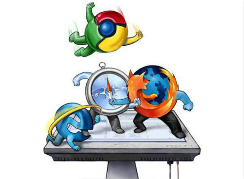

# 兼容性

#### 1. 啥是兼容性？

如：移动与联通。

同样的代码在不同的浏览器程现不同的效果。
如：border-radius:5px;

#### 2. 阻碍HTML5发展的罪魁祸首？

1. 北京时间2008年3月6日，微软发布了InternetExplorer 8的第一个公开测试版本(beta1)。而IE8诞生于早期，绝大部分的HTML5新特性都不支持的。而且IE浏览器凭借着 Windows 操作系统，几乎垄断了市场占有率。
2. 早期 W3C 标准没有完善时，IE浏览器有自己的一套标准。
3. 浏览器厂商为了争夺市场份额，各自使用专属格式，不尊重公开标准，从而导致兼容性问题。
4. IE当时在桌面浏览器占有垄断地位，扩展了大量的IE Only语法。

#### 3. 移动互联网加速推动了HTML5的发展

Android 1.0。2008年9月23日发布，这也是Android系统最早的版本。
移动设备绝大部分使用的是Android系统。
移动互联网是推动HTML5的发展的对象之一，移动设备绝大部分的浏览器都是使用chrome的内核。


#### 4. HTML5支持的情况？

最新版本的 Safari、Chrome、Firefox 以及 Opera 支持某些 HTML5 特性。Internet Explorer 9 支持某些 HTML5 特性,经过测试Internet Explorer10 基本已经支持绝大部分HMTL5标签及属性。

2016年1月，微软正式淘汰IE 8/9/10浏览器。在未来几年，兼容性有望会得到统一。

从硬件角度来看，国内手机和平板两种移动设备应用最广，PC端次之，紧接着是电视和游戏设备。
从软件角度来看，桌面浏览器对HTML5的支持高于移动浏览器，最高可达95%；而从整体上而言，移动浏览器对HTML5的支持却优于桌面浏览器。


# 浏览器诞生时间轴(了解)

1. 1995年 IE 1.0
    1995年8月16日，微软InternetExplorer1.0发布，它是微软将收购的Spyglass旗下Mosaic浏览器（1987年开发完成）改组而成的。
    最初的IE只有1MB，功能也十分简单。它并不是和Windows95同时发布的，不过后来却成为Windows95PlusPack的一部分。

2. 1995年IE2.0
    2.0版本新增了对SSL、cookies等技术的支持，不过页面仍然很简单。

3. 1996年IE3.0
    1996年Windows95的OEM原始设备制造商版本进行了升级，IE3就被捆绑在其中，新增了Mail和News功能。

4. 1997年IE4.0
    IE4新增了ActiveDesktop活动桌面，支持DHTML，OutlookExpress4.0也包含其中。

5. 1999年IE5.0
    IE5对CSS1和CSS2的支持使得文本渲染得到了增强。

6. 2001年IE6.0
    IE6与WindowsXP这对黄金组合统治了互联网多年，如今微软通过种种措施来鼓励用户放弃IE6升级至最新的IE版本。

7. 2006年IE7.0
    微软受到来自MozillaFirefox的竞争压力，在IE7发布时，Firefox2.0也问世了，值得一提的是，IE7首次独立于操作系统作为一款应用程序存在。

8. 2009年IE8.0
    按照微软的说法，IE8是当前全球增长最快和最受欢迎的一款浏览器。

9. 2010年IE9.0
    IE9引入了 CSS3 Color Module 的支持，包括其中已普遍使用的透明度( opacity )属性。微软曾在5月份宣布将把HTML5作为IE9的核心，并将全力投入HTML5。

Google
    1998年9月4日，Google以私营公司的形式创立，设计并管理一个互联网搜索引擎“Google搜索”。
    2008年12月12日 - 经过15个Beta测试版，Google Chrome浏览器终于发布了第一个正式版，版本号1.0.154.36


### mosaic早期浏览器
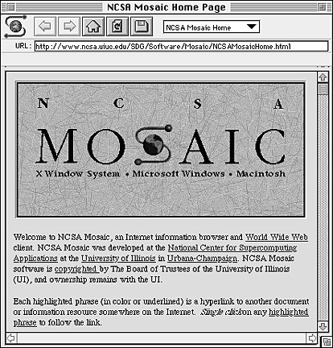

### Chrome浏览器发展史
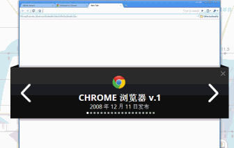

### Firefox浏览器发展史
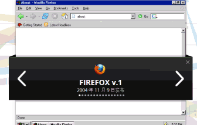

### IE浏览器发展史
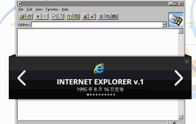

### NETSCAPE浏览器发展史
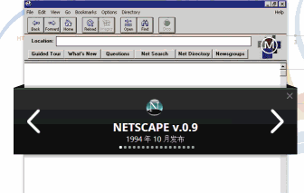

### Opera浏览器发展史
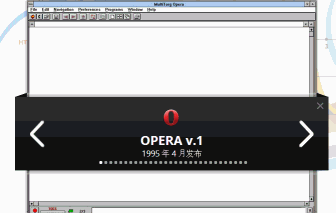


____


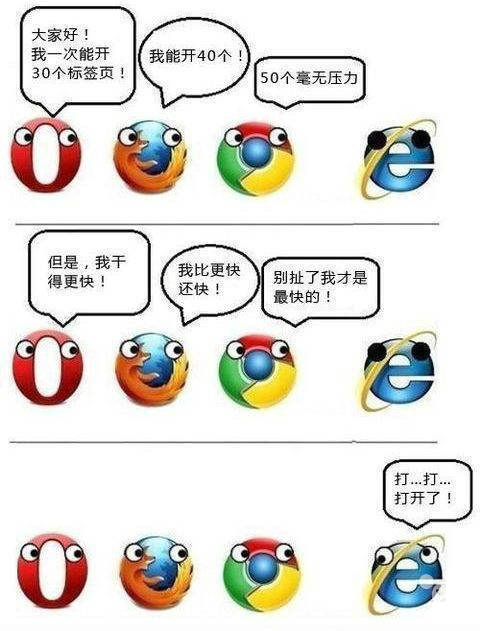


# 简单HTML实例制作

    ````实例：
    <html>
    	<head>
    		<title>web</title>
    	</head>
    	<body bgcolor='black' text='#ffffff'>
    		<h1 align="center">Web</h1>
    
    		<hr width='80%'/>
    
    		<h2 align="center">Welcome !</h2>
    
    		<h3 align="center">
    			<input type="text">
    			<input type="text" readonly>
    			<input type="text" readonly="readonly">
    		</h3>
    
    	</body>
    </html>
    
    ````

# HTML语法(重点)
    1. HTML 文档注释
        1. 注释就是代码的说明书 方便理解、方便查找或方便项目组里的其它程序员了解你的代码，而且可以方便以后你对自己代码进行修改。
        2. 不被程序执行的代码
        3. 注释不会显示在浏览器
        4. 注释里面不要再嵌套注释
    
    2. HTML标签
        1. 标签都是闭合的
        2. 两种形式：成对与不成对
            单标签：
                <标签名/> 或 <标签名>
            双标签：
                <标签名></标签名>
                <起始标签></结束标签>
    3. HTML 元素
    	元素指的是开始标签与结束标签之间的内容。
    
    4. HTML语法不区分字母大小写
    
    5. HTML，异常灵活，语法松散。
        HTML不会有什么报错提示，发现错误的方式就是查看标签是否正常显示效果。
    	<sb></sb>
    
    6. HTML标签属性
        1. 以键值对形式出现在起始标签内。描述标签的附加信息。
        2. 如果有多个属性，用空格分隔开，属性之间无顺序之分。
        3. 属性值可以用双引号或单引号，甚至可以不用。推荐使用。
            key=value -- 设置啥属性，设置成什么样子。
            三种形式:
                `<hr width="80%">`
                `<hr width='80%'>`
                `<hr width=80%>`
            建议添加引号，推荐双引号！
    
    7. HTML 代码格式
        1. 任何回车或空格在源代码都不起作用，可以用来排版。
        2. 浏览器总是会截短 HTML 页面中的空格。如果您在文本中写 10 个空格，在显示该页面之前，浏览器会删除它们中的 9 个(可以使用实体)。
        3. 按照规范，以4个空格为标准。
    
    8. HTML 字符实体
        1. 在 HTML 中，某些字符是预留的。让浏览器显示特殊的符号。
        2. 在 HTML 中不能使用小于号（<）和大于号（>），这是因为浏览器会误认为它们是标签。
        3. 如果希望正确地显示预留字符，特殊字符，我们必须在 HTML 源代码中使用字符实体（character entities）。
    
            http://www.w3school.com.cn/tags/html_ref_entities.html
            http://www.w3school.com.cn/tags/html_ref_symbols.html
    
    9. HTML颜色值
        1. 颜色名
            W3C 的 HTML 4.0 标准仅支持 16 种颜色名，它们是：aqua ['ækwə]、black、blue、fuchsia ['fjuːʃə]、gray、green、lime[laɪm]、maroon [mə'ruːn]、navy ['neɪvɪ]、olive ['ɒlɪv]、purple ['pɜːp(ə)l]、red、silver ['sɪlvə]、teal [tiːl]、white、yellow。
    
            文档:
                http://www.w3school.com.cn/tags/html_ref_colornames.asp
    
        2. RGB格式
            * 颜色是由三原色组成:红(Red)，绿(Green)，蓝(Blue)。
            * 以井号开头，后面接十六进制颜色值。
                #000000 -- #FFFFFF 或 #000  -- #FFF
            * 每个颜色有256种彩度，因此，三原色可混合成 256*256*256 种颜色。
    
    10. 可以省略标签(绝对不可以省略)
        默认存在的标签 html,head,body

# HTML主体结构(重点)
    1. 文档类型声明(DTD声明，声明渲染方式)
    
        浏览器的差异性，一般差异性有两点，HTML+CSS渲染效果不同(HTML+CSS在不同的浏览器效果不同)，以及JavaScript支持的不同。
    
        怪异模式:
            每一款浏览器都有自己的渲染方式，这种模式我们成为怪异模式，即各大浏览器按照自己的意愿显示效果。
        标准模式:
            按照W3C标准进行渲染
    
        如果不写DTD声明，浏览器默认会走怪异模式。
    
        1. 编写HTML5文档时，要求指定文档类型，以确保浏览器能在HTML5标准下进行渲染。
        2. 不是 HTML 标签。它为浏览器提供一项信息（声明），即 HTML 是用什么版本编写的。
        3. 必须写在第一行。
            HTML5  的文档声明
                <!doctype html>
    
                * 声明没有结束标签。
                * 声明对大小写不敏感。
    
            HTML 4.01 的文档声明
                <!DOCTYPE HTML PUBLIC "-//W3C//DTD HTML 4.01 Transitional//EN"
                "http://www.w3.org/TR/html4/loose.dtd">
    
    2. <html>
        标记HTML文档的开始与结束。文档的根元素。
    
        属性: lang
        值: #语言属性
    
    3. <head> 头信息
        1. 描述当前网页的信息，<head> 中的内容不会显示在浏览器中。
        2. 为浏览器提供有价值的信息。
            如：引用CSS样式表，HTML所使用的字符集，提供元信息。
    
        3. 为搜索引擎提供能被搜索到的信息。
            如：网站的作者，网站的标题。
    
    4. <body>
        body之间包含是文档的主体内容，用户能在浏览器中直观地看到。
        如：文字，图片，视频，表单等等。

# 语言属性 lang(了解)
    zh-CHS 是单纯的简体中文。
    zh-CHT 是单纯的繁体中文。
    zh-Hans和zh-CHS相同相对应。
    zh-Hant和zh-CHT相同相对应。
    以上时zh-CHS/zh-Hans 和 zh-CHT/zh-Hant的关系。
    
    zh-CN 简体中文，中华人民共和国
    zh-HK 繁体中文，香港特别行政区
    zh-MO 繁体中文，澳门特别行政区
    zh-TW 繁体中文，台湾
    en      英语
    en-US   美式英语
    zh-cn   简体中文
    zh-tw   繁体中文
    da-dk   丹麦语
    nl-nl   荷兰语
    en-us   英语
    fi-fi   芬兰语
    fr-fr   法语
    de-de   德语
    it-it   意大利语
    ja-jp   日语
    ko-kr   朝鲜语
    nb-no   挪威语
    pt-br   葡萄牙语
    es-es   西班牙语
    es-us   西班牙语（美国）
    sv-se   瑞典语

# HTML头部元素 <head> (重点)

    1. <title> 设置网站标题
        必须设置，就像一本书的书名
    2. <link>
        链接一个外部样式表:
            type:	链接文档的MIME类型
                text/css      层叠样式表
                image/x-icon  图标
                image/png     png 图片
    
            rel:	包含超链接的文档与目标资源之间的关系
                stylesheet    层叠样式表
                bookmark      收藏时的图标文件
                icon          图标
            href:	被链接文档的位置


    3. <style> 定义文档的样式信息
    
    4. <script>	定义客户端脚本
            属性	      值	          描述
            type        string      文本的类型
            async	    async	    规定异步执行脚本（仅适用于外部脚本）。
            charset	    charset	    规定在外部脚本文件中使用的字符编码。
            defer	    defer	    规定是否对脚本执行进行延迟，直到页面加载为止。
            src	        URL	        规定外部脚本文件的 URL。
    
    5. <meta> 定义关于 HTML 文档的元信息。
        * 所谓元信息指的就是定义文档的关键字，作者，描述等信息。
        * 目的就是让搜索引擎能够凭借这些信息找到我们的网站。
        1. <meta http-equiv="content-type" content="text/html;charset=ut-8"/>
        2. <meta charset='utf-8'/>
        3. <meta http-equiv="refresh" content="3"/>
        4. <meta http-equiv="refresh" content="3;url=http://www.baidu.com"/>
    
        5. <meta name="copyright" content='本页版权归xxx所有'/>
        6. <meta name="keywords" content="关键字1,关键字2"/>
        7. <meta name="description" content="网站描述"/>
        8. <meta name="author" content="网站作者"/>

# 文本标签
    1. <p>  定义段落
    
    2. <h1> to <h6> 定义 HTML 标题
        * 每个页面只能存在一个 <h1> 标签(存在多个无意义)
    
    3. <sub>	定义下标文本。
        * sub与sup，在数学等式、科学符号和化学公式中都非常有用。
    
    4. <sup>	定义上标文本。
    
    5. <del> 与 <ins>
        描述:
            <del> 定义被删除文本。
            <ins> 定义被插入文本。
    
            * del定义文档中被删除的文本内容，ins用来描述文档中的更新和修正，del的浏览器默认样式是带删除线，ins默认是带下划线的，这点也可以很好的说明两者的用法，通常情况下两个元素配合起来意思使用。
    
        参数:
            属性      值         描述
            cite     url        此文档可解释文本被插入的原因。
            datetime datetime   定义文本被修改的日期和时间。日期与时间之间要插入英文字母 T (表示 time )。中国与世界标准时相差8个小时，所以最后要加上 +08:00 。
    
    6. <bdo>	定义文字方向。
    
        属性      值       描述
        dir      ltr/rtl  定义文字方向

# 字体样式元素
    1. <b>	    定义粗体字，呈现粗体文本效果
    
    2. <i>	    定义斜体字，显示斜体文本效果
    
    3. <small>	定义小号文本。
        HTML5 对 small 元素进行了重新定义，通常用于定义诸如:免责声明,注意事项,法律规定,版权信息, 版权声明,法律条款 等。通常定义在底部。

# 文本格式标签
    1. <hr />	表现为水平线，同时表示主题结束。
    
    2. <br />	定义简单的折行。
    
    3. <abbr>	定义缩写。
    
    4. <q>	定义短的引用。
        * 引用的是一句话或者一句文档摘要
    
    5. <blockquote>	定义长的引用。
        * 一段或者大篇幅文本的引用
        <q> 可以只包含存文本，或者内联元素，但blockquote的子节点必须为块元素，而不能是文本或者内联元素。
    
        回顾:
            <cite></cite> 引用书名，文献等
            <q></q> 引用一句话，一句文档摘要
            <blockquote></blockquote> 引用一段，一篇文本
    
    6. <pre> 定义预格式文本

# 短语元素
    * 这些标签都拥有确切的语义
    
    1. <em> 把文本定义为强调的内容
    
    2. <strong> 把文本定义为重点强调的内容
    
    3. <code> 定义计算机代码文本
    
    4. <samp>
        定义样本文本，表示一段用户对其没有什么其他解释的文本字符，标签来标记程序输出的内容
    
    5. <dfn> 定义一个定义项目(尽量少用为妙)
    
    6. <kbd> 定义键盘文本
        * 它表示文本是从键盘上键入的。它经常用在与计算机相关的文档或手册中。
    
    7. <var> 定义变量
    
    8. <cite>定义引用</cite>
            * cite是用来标明引言的，所谓引言，就是对一本书、一篇报告或其它出版的来源资料的引用。
            可使用该标签对参考文献的引用进行定义，比如书籍或杂志的标题。

# 列表标签(重点)
    1. <ul>	定义无序列表。
    2. <li>	定义列表的项目。
    
    3. <ol>	定义有序列表。
        属性 		   值 				描述
        reversed 	reversed 		  规定列表顺序为降序
        start 		number 			  规定有序列表的起始值
        type 		1、A、a、I、i  	   从a开始索引，从I开始索引


    4. <dl>	元素代表一个描述列表，该元素包含一组术语和描述的列表
    5. <dt>	定义列表中的标题
    6. <dd>	定义定义列表中项目的描述

# 超链接(重点)
    * <a>	定义超链接与锚点
        ````参数:
            属性 	  值 			  描述
        	href 	url 			指定要跳转的地址
        	target  _blank / _self 	指定新网页打开位置
        ````
    1. 锚点
    	页面内跳转
    2. 超链接
        概念
            1. 相对地址
                有参照物，位置视乎参照物而决定。地址是相对存在的。
            2. 绝对地址
                互联网上的独立地址，在任何网站通过这个地址可以直接到达目标网页，一条完整的路径。
            3. 当前目录与上级目录
                * 任何目录下都有当前目录与上级目录
                .  当前目录
                .. 上级目录


    * <base />	定义页面中所有链接的默认地址或默认目标。

# 图片标签(重点)
    1. 	定义图像。
        属性 		  值 				描述
    	width 		number(pixel) 	  宽
    	height      number(pixel) 	  高
        alt	        text	          规定图像的替代文本。
    	src 		URL 			  图片源
    	usemap 		URL 			  将图像定义为客户器端图像映射。
        ismap       URL	              将图像定义为服务器端图像映射。
    
        ismap属性：
    	    1. 用户在 ismap 图像上单击了某处时，浏览器会自动把鼠标的 x、y 位置（相对于图像的左上角）通过GET方式发送到服务器端。
    	    2. 只有img标签包含在a标签内，并且a标签带有href属性时，ismap才能使用
    
    2. <map>	定义图像映射。
    3. <area />	定义图像映射内部的区域。
        属性	   值			描述
    	coords	坐标值		    定义可点击区域坐标。
    	href	URL			  定义此区域的目标 URL。
    	shape 	default 	  定义区域的形状。
    			rect          矩形
    			circ          圆形
    			poly          多边形
    	target  _blank  	  新窗口打开
    			_parent 	  父级窗口
    			_self 		  本窗口
    			_top 		  顶层窗口__
    
    * img可以单独使用！ map,area 必须img配合使用

# 表格标签(重点)
    1. <table>	 定义表格。
    
        属性		   值				  描述
    	align   	left/center/right 	设置对齐方式
    	bgcolor 	颜色值				  设置背景颜色
    	border		pixels 				边框宽度
    	cellpadding	pixels / %			规定单元边沿与其内容之间的空白。
    	cellspacing	pixels / %			规定单元格之间的空白。 			
    	width       pixels / %          表格宽度
    	height      pixels / %	        表格高度
    
    2. <caption>	定义表格标题。
    
        属性		   值				  描述
        align   	left/center/right 	设置对齐方式
    
    3. <tr>	定义表格中的行。
    
        属性		   值				  描述
        align       right               定义表格行的内容对齐方式。
                    left
                    center
                    justify
        bgcolor     颜色值               规定表格行的背景颜色。
        valign      top                 规定表格行中内容的垂直对齐方式。
                    middle
                    bottom
                    baseline
    
    4. <th>	定义表格中的表头单元格。(th的属性与td一致)
    
    5. <td>	定义表格中的单元。(th的属性与td一致)
    
        属性		值 			  描述
        abbr 		text 		规定单元格中内容的缩写版本
        align 		left
                    right
                    center
        valign		top			规定单元格内容的垂直排列方式
                    middle
                    bottom
                    baseline
        bgcolor   	颜色值 	  规定表格单元格的背景颜色
        * colspan		number		设置单元格可横跨的列数。
        * rowspan		number		规定单元格可横跨的行数
        width		pixel/%     单元格的宽
        height		pixel/%     单元格的高
    
    x6. <col />	定义表格中一个或多个列的属性值。
    
        属性	       值	        描述
        * span	    number	      规定 col 元素应该横跨的列数。
    
    x7. <colgroup>	定义表格中供格式化的列组。
    
        属性	       值	        描述
        * span	    number	      规定 col 元素应该横跨的列数。


    8. <thead>	定义表格中的表头内容。
    
    9. <tbody>	定义表格中的主体内容。
    
    10. <tfoot>	定义表格中的表注内容（脚注）。
    
    * thead,tbody,tfoot 应该结合使用。
    * 类似，bgcolor,width,height,align,valign,border 等属性是无关紧要的，以后使用CSS设置。

# 表单标签(重点)
    1. <form>	    定义供用户输入的 HTML 表单。
        属性 		   值 			      描述
    	* method  	post/get         	定义HTTP发送方式
    	* action 		url 		        表单提交的地址
    	* enctype 	multipart/form-data 如果表单包含文件上传域，则必须传
    	name 		text  		        规定表单的名称。
    	target 		_blank
    				_self
    				_parent
    				_top           __
    
    2. <input>	    定义输入控件。
    
        属性 		   值 			      描述
        name        field_name          定义 input 元素的名称。
        value       value               为 input 元素设定值。
        type        * text文本域         规定 input 元素的类型。
        			* password 密码域
        			* radio    单选框
        			* checkbox 复选框 		
        			* hidden   隐藏域
        			* file 	   文件上传域
        			* button   无意义按钮
        			* reset    重置
        			* submit   提交
        			image 	   图片按钮
    
        alt         text	             定义图像输入的替代文本。
        src	        URL	                 定义以提交按钮形式显示的图像的 URL。
    
        checked	    checked	             规定此 input 元素首次加载时应当被选中
        disabled	disabled	         当 input 元素加载时禁用此元素。
        size        characters/pixels    input 元素的宽度。
    
    3. <textarea>	定义多行的文本输入控件。
        属性		  值			          描述
    	name		name_of_textarea	规定文本区的名称。
    	cols		number		        规定文本区内的可见宽度。
    	rows		number		        规定文本区内的可见行数。
    	disabled	disabled	        规定禁用该文本区。
    	readonly	readonly	        规定文本区为只读。
    
    4. <select>	定义选择列表（下拉列表）。
        属性         值              描述
        disabled    disabled        规定禁用该下拉列表。
        multiple    multiple        规定可选择多个选项。使用改值，name需要为数组形式
        name        name            规定下拉列表的名称。
        size        number          规定下拉列表中可见选项的数目。
    
        * multiple 与 size 搭配使用
    
    5. <option>	定义选择列表中的选项。
        属性		   值	      描述
    	disabled	disabled	规定此选项应在首次加载时被禁用。
    	selected	selected	规定选项（在首次显示在列表中时）表现为选中状态。
    	value		text		定义送往服务器的选项值。
    
    6. <optgroup>	定义选择列表中相关选项的组合。
        属性		   值		  描述
        label		text		为选项组规定描述。
        disabled	disabled	规定禁用该选项组。
    
    7. <label>	    定义 input 元素的标注。
        属性	     值		     描述
    	for		  id		   规定 label 绑定到哪个表单元素。
    	form(h5)  formid	   规定 label 字段所属的一个或多个表单。
    
    8. <button>	定义按钮 (push button)。
        属性	          值		          描述
        name	       button_name	    规定按钮的名称。
        value	       text	            规定按钮的初始值。可由脚本进行修改。
        type           button           规定按钮的类型。
                        reset
                        submit


# 重要
    * 众多HTML标签的属性里面:宽，高，边框，边距，颜色，水平居中，垂直居中等样式属性都不重要，以后可以使用CSS设置。

# 无意义标签(布局使用)
    <span> 行内元素
    <div>  块级元素

# 可以了解的内容
    1. <body> 属性：
        属性 			   描述
        leftmargin 		页面的左边距
        topmargin 		页面的上边距
        text 			页面的文字颜色
        bgcolor 		背景颜色


# 不赞成使用(已经被淘汰)
    <applet>	定义嵌入的 applet。
    <basefont>	定义页面中文本的默认字体、颜色或尺寸。
    <dir>	    定义目录列表。
    <font>	    定义文字的字体、尺寸和颜色。
    <s>	        定义加删除线的文本。
    <u>	        定义下划线文本。
    <xmp>	    定义预格式文本。
    <isindex>	定义与文档相关的可搜索索引。
    <strike>	定义加删除线文本。
    <center>	定义居中文本。
    <acronym>	定义只取首字母的缩写。
    <tt>	    定义打字机文本。(小号等宽字体)
    <big>	    定义大号文本。


<!--  -->

